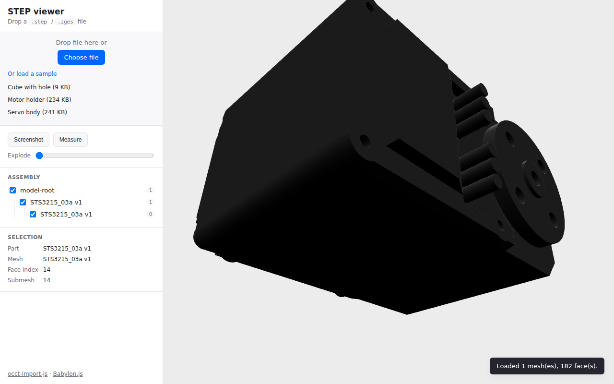

# cad-3d-viewer

Drag-drop a `.step` / `.iges` / `.brep` file into the browser and look at it.
No backend, no upload, no COOP/COEP headers — the file is parsed locally by a
WebAssembly build of [Open CASCADE Technology](https://dev.opencascade.org/)
and rendered with [Babylon.js](https://www.babylonjs.com/).



## Why

CAD source files (STEP, IGES, BREP) are still the canonical exchange format
for mechanical engineering work, and almost every "show me this part" workflow
still ends with someone opening a desktop CAD tool or uploading to a paid
service. The pieces to do it client-side have been available for a while —
this repo is a small, focused recipe that puts them together with Babylon.js.

Features:

- Drop any `.step` / `.stp` / `.iges` / `.igs` / `.brep` file → mesh, in 1–3 s
  for typical mechanical parts
- Per-face picking (each B-rep face is its own pickable submesh)
- Runtime exploded view (slider controls the offset, no special export needed)
- Two-point distance measurement
- Assembly-tree sidebar (toggle visibility, click a row to frame the subtree)
- One-click PNG screenshot

## Quick start

```bash
npm install
npm run dev      # http://localhost:5173
npm run build    # type-check + production bundle into dist/
npm run preview  # serve the built bundle
```

Open the dev server, click **"Or load a sample"** in the sidebar, or drop your
own STEP file on the canvas.

Add `?inspector=1` to the URL to open the Babylon Inspector for the scene.
Add `?debug=1` to expose `window.__scene` / `window.__engine` for the console.

## How it works

```
┌──────────────────┐   transfer ArrayBuffer    ┌──────────────────────┐
│  main thread     │ ─────────────────────────▶│  classic web worker  │
│  Babylon scene   │                           │                      │
│  drop / fetch    │                           │  importScripts:      │
│  builder.ts ─────┤◀─── OCCT JSON  ───────────┤   occt-import-js.js  │
│  per-face submesh│                           │   comlink.js (UMD)   │
└──────────────────┘                           │   .wasm loaded once  │
                                               └──────────────────────┘
```

1. The main thread reads the dropped file into an `ArrayBuffer` and posts it
   to a Web Worker via [Comlink](https://github.com/GoogleChromeLabs/comlink).
2. The worker calls `ReadStepFile` / `ReadIgesFile` / `ReadBrepFile` from
   [occt-import-js](https://github.com/kovacsv/occt-import-js) — a synchronous
   C++/Emscripten call that returns a JSON describing the node hierarchy and
   triangulated meshes.
3. The main thread walks that JSON in `builder.ts` and builds a Babylon
   `TransformNode` tree, with one `Mesh` per OCCT mesh and one `SubMesh` per
   B-rep face. The per-face submeshes are what makes face picking trivial:
   `PickingInfo.subMeshId` indexes directly into a `Map<…, FaceRef>`.

The OCCT WASM binary is ~7.6 MB. It's loaded lazily — the worker spins up only
after the first load action, so the initial page paint isn't blocked.

## Gotchas worth knowing if you build something similar

- **No SharedArrayBuffer needed.** occt-import-js is a single-threaded
  Emscripten build, so you avoid the whole COOP/COEP isolation rabbit hole.
- **Use a worker.** `ReadStepFile` is synchronous C++; on a real assembly it
  blocks the calling thread for seconds. The viewport will freeze if you call
  it from the main thread.
- **Classic worker, not ESM.** The upstream UMD bundle predates the ESM-worker
  era and trips up Vite's bundler (it probes `__filename` and conditionally
  `require('fs')`). Loading it via `importScripts()` in a classic worker is
  cleaner than fighting the bundler — see `src/loader.worker.ts`.
- **`locateFile`.** Emscripten resolves `.wasm` relative to the script URL,
  which doesn't survive bundling. Always pass `locateFile` explicitly:
  ```js
  occtimportjs({ locateFile: (p) => `/occt-import-js/${p}` })
  ```
  The Vite `vite-plugin-static-copy` plugin publishes the WASM at that path in
  both dev and prod.
- **~100 MB ceiling.** The 32-bit Emscripten heap caps STEP parsing somewhere
  near 100 MB. This repo bails at 90 MB with a friendly toast instead of an
  obscure OOM crash.
- **STEP files carry colors.** OCCT honours the colors the STEP authoring tool
  baked in. A "dark gray plastic" part stays dark gray in the viewer — that's
  not a rendering bug, it's the source.

## File map

| Path                              | Purpose                                                |
|-----------------------------------|--------------------------------------------------------|
| `src/main.ts`                     | Entry point. Wires features to sidebar.                |
| `src/scene.ts`                    | Babylon engine, camera, lighting, render loop.         |
| `src/loader.ts`                   | Main-thread wrapper around the worker.                 |
| `src/loader.worker.ts`            | Classic worker hosting occt-import-js.                 |
| `src/builder.ts`                  | OCCT JSON → Babylon mesh tree, per-face submeshes.     |
| `src/camera-frame.ts`             | AABB-based fit-to-view.                                |
| `src/features/picking.ts`         | Hover/select via vertex-color stamping per face.       |
| `src/features/tree.ts`            | Assembly-tree DOM from the OCCT node hierarchy.        |
| `src/features/explode.ts`         | Centroid-based runtime exploded view.                  |
| `src/features/measure.ts`         | Two-point distance with GUI label.                     |
| `src/features/screenshot.ts`      | `Tools.CreateScreenshotUsingRenderTargetAsync` wrapper.|
| `public/samples/`                 | Bundled sample STEP files (see ATTRIBUTION).           |

## Licensing

- This repo's code is **MIT** (see `LICENSE`).
- `occt-import-js` is **LGPL-2.1** (Open CASCADE), loaded as a separate WASM
  blob at runtime — see `ATTRIBUTION.md`.
- Bundled `.step` samples are **Apache-2.0** from
  [Formlabs/foxtrot](https://github.com/Formlabs/foxtrot) and
  [TheRobotStudio/SO-ARM100](https://github.com/TheRobotStudio/SO-ARM100) —
  see `public/samples/ATTRIBUTION.md`.

## Acknowledgements

- [Viktor Kovacs](https://github.com/kovacsv) for **occt-import-js** and the
  reference [Online 3D Viewer](https://3dviewer.net/) it powers.
- The **Babylon.js** team for a renderer that makes this kind of small
  experiment so direct to write.
